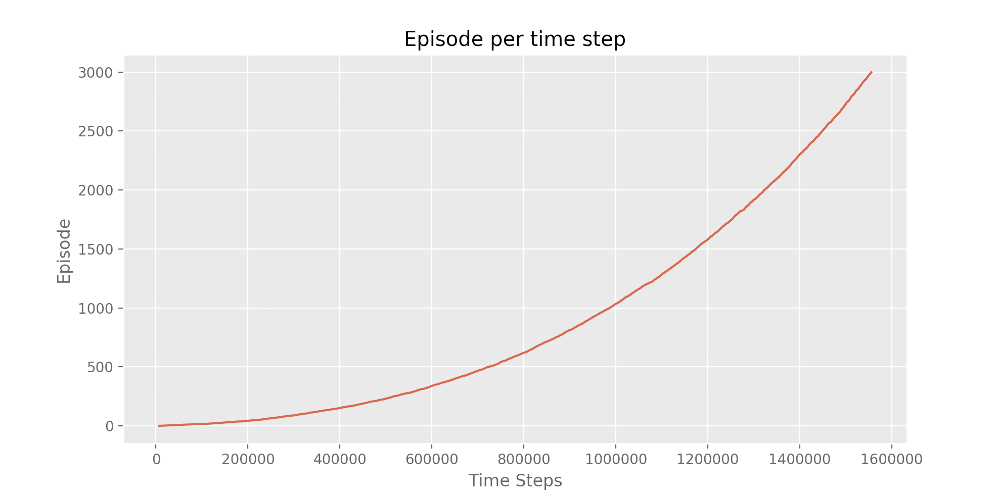

# Reinforcement-Learning-for-Uncertain-Environment

Robot learn to walk in uncertain environment

<table align="center">
  <tr>
    <td>  </td>
	<td>  </td>
  </tr>
</table>

<table align="center">
  <tr>
    <td>  </td>

  </tr>
</table>

<table align="center">
  <tr>
    <td>  </td>

  </tr>
</table>

<table align="center">
  <tr>
    <td>  </td>

  </tr>
</table>